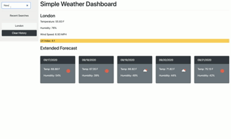

# Weather-Dashboard
Weather dashboard for class.

This simple dashboard was built using JQuery + Bootstrap and utilizes the Open Weather API.
Enter a city name to see the current weather and a 5-day forecast.

If this is your first time using -- we will default you to Jolly Olde London.

# Improvements to be made
Cleaner searching of cities would be great. I have to pass around to a handful of API endpoints to get the result I want. 
Would like o work on the style. but I designed to match the example in this case. Would like tidier cards.

